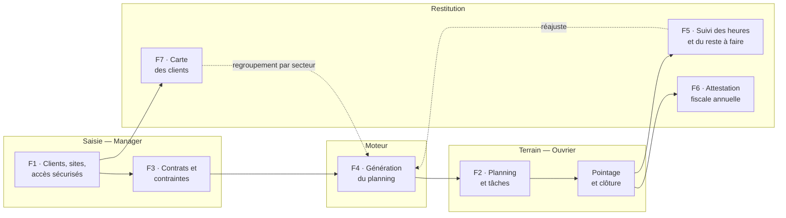
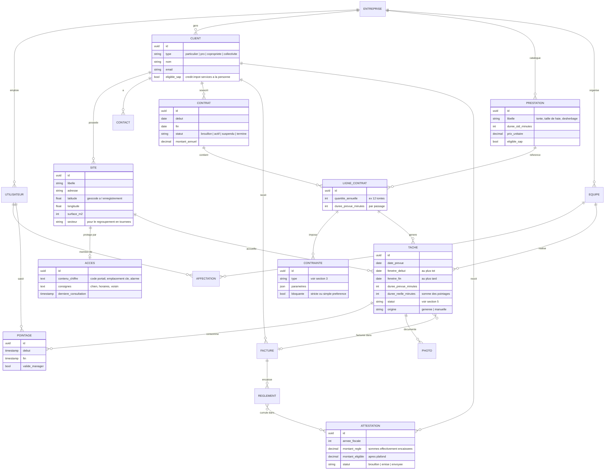
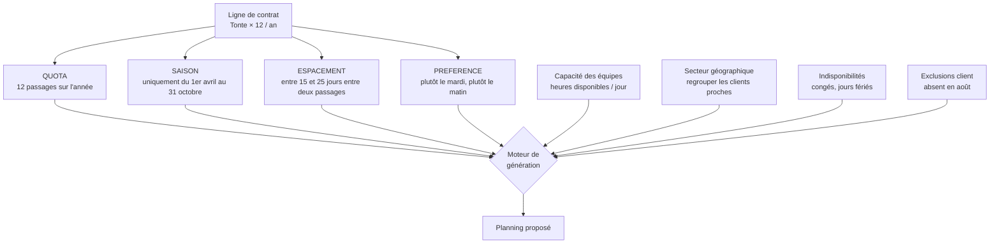
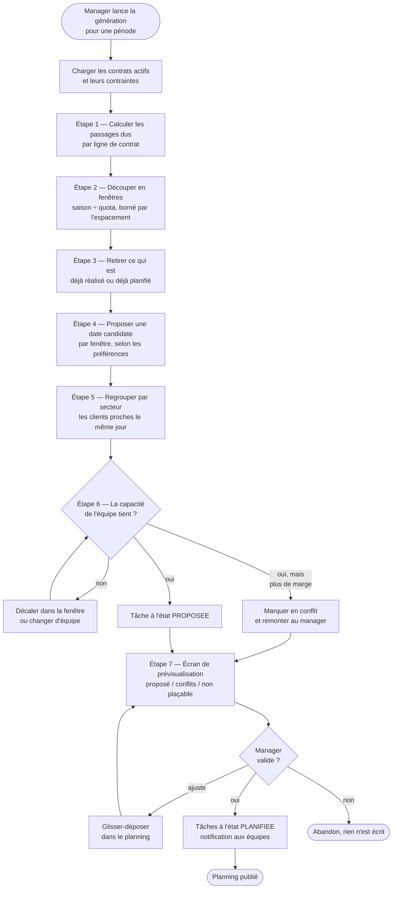
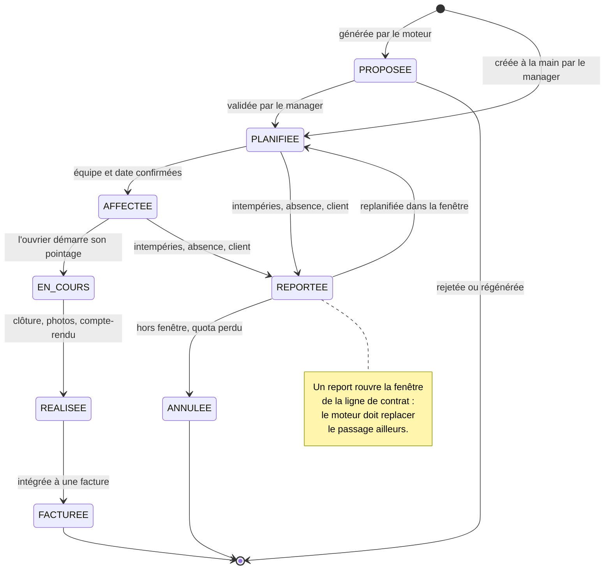
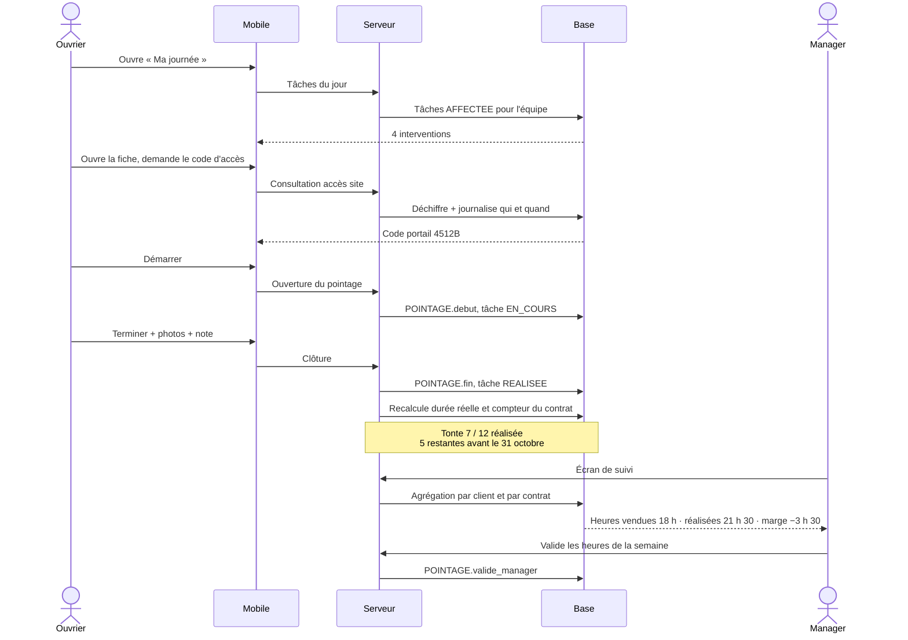
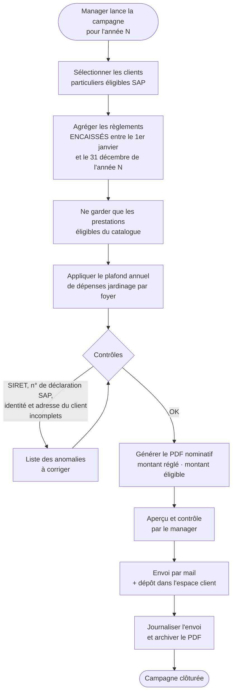
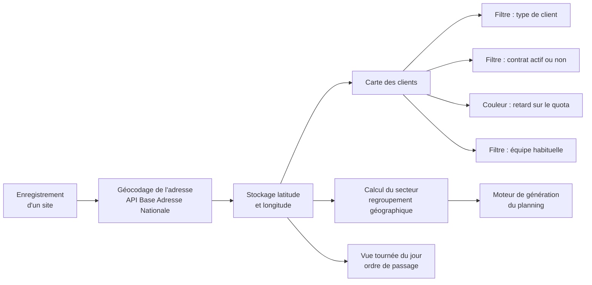
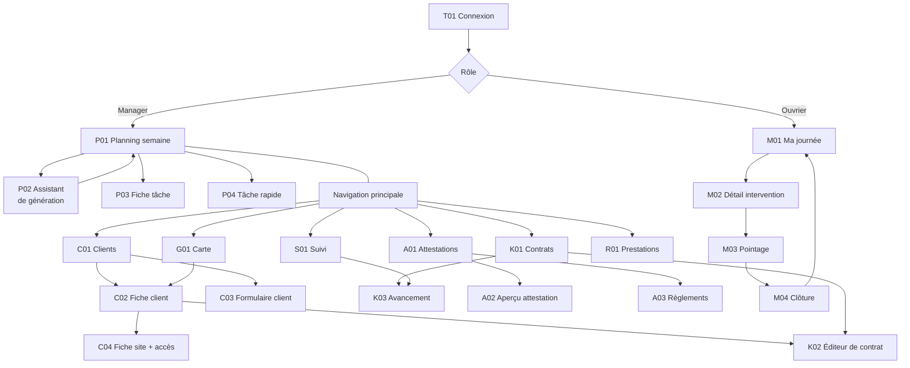

# Planisage — Conception du POC

**Périmètre retenu (6 fonctionnalités + carto)**

| # | Fonctionnalité |
|---|---|
| F1 | Saisie des informations clients, y compris les informations sensibles (codes d'accès, clés, consignes) |
| F2 | Ajout de tâches dans le planning |
| F3 | Contraintes sur les tâches (ex. contrat de 12 tontes par an) |
| F4 | Génération d'un planning à partir des contraintes de chaque client |
| F5 | Suivi des tâches : heures réalisées chez un client, reste à faire |
| F6 | Envoi du bordereau de déduction fiscale au client |
| F7 | Cartographie : répartition des clients sur une carte |

---

## 1. Vue d'ensemble

Le point important : **F4 alimente F2, et F5 réalimente F4.** Si un passage saute
(intempéries, absence), le moteur doit replanifier le reste de l'année pour tenir le
quota du contrat. C'est ce qui fait la valeur du produit, et c'est la partie la plus
délicate à construire.

---

## 2. Modèle de données

### Points d'attention sur le modèle

**`ACCES` est une table à part, et c'est volontaire.** Un code de portail ou
l'emplacement d'une clé n'est pas un champ de commentaire comme un autre :

- contenu chiffré en base, jamais en clair dans les journaux ni dans les exports ;
- visible par l'ouvrier **uniquement** le jour où il a une tâche sur ce site, et
  masqué derrière un bouton « afficher » ;
- chaque consultation est horodatée — si un cambriolage a lieu, ton ami doit pouvoir
  dire qui a vu le code et quand ;
- purge ou rotation quand le client part.

**`TACHE` porte une fenêtre, pas seulement une date.** `fenetre_debut` /
`fenetre_fin` sont ce qui permet au moteur de décaler un passage sans casser le
contrat. Une tâche qui n'a qu'une date est impossible à replanifier proprement.

**`duree_reelle_minutes` est dérivée des pointages**, jamais saisie directement :
c'est elle qui fait tout le §6 (suivi) et qui révèle si un contrat est rentable.

---

## 3. F3 — Les contraintes

C'est le cœur du sujet et la partie que le questionnaire doit préciser. Un « contrat de
12 tontes par an » n'est pas une contrainte, c'est **quatre** contraintes qui se
combinent :

### Catalogue des types de contrainte à implémenter

| Type | Paramètres | Exemple | POC |
|---|---|---|:--:|
| `QUOTA` | nombre, période | 12 tontes par an | ✅ |
| `SAISON` | date début, date fin | tonte d'avril à octobre | ✅ |
| `ESPACEMENT` | min jours, max jours | 15 à 25 jours entre deux tontes | ✅ |
| `JOUR_PREFERE` | jours de la semaine | mardi ou jeudi | ✅ |
| `EXCLUSION` | plages de dates | client absent du 1er au 20 août | ✅ |
| `DUREE` | minutes | 1 h 30 par passage sur ce site | ✅ |
| `CRENEAU` | heure début, heure fin | uniquement le matin | ⬜ V1 |
| `EQUIPE_IMPOSEE` | équipe | toujours l'équipe de Marc, le client la connaît | ⬜ V1 |
| `METEO` | seuil | pas de tonte si pluie la veille | ⬜ V1 |
| `PRE_REQUIS` | tâche | tailler avant de désherber | ⬜ +tard |

**Question à poser à ton ami :** est-ce que le quota est **ferme** (12 passages dus,
point) ou **indicatif** (on tond quand l'herbe pousse, environ 12 fois) ? Les deux
existent dans le métier et ils ne produisent pas le même moteur. Le premier se
planifie un an à l'avance ; le second demande un ajustement permanent et une notion de
« prochain passage souhaitable ».

---

## 4. F4 — Génération du planning

### Trois règles de conception à tenir

1. **Le moteur propose, l'humain valide.** Rien n'est écrit dans le planning réel
   avant la validation du manager. Un moteur qui écrit tout seul est rejeté par les
   utilisateurs dès le premier passage aberrant.
2. **Une génération est rejouable et ne détruit rien.** On régénère uniquement ce qui
   est encore à l'état `PROPOSEE` ; ce qui est validé, déplacé à la main ou déjà
   réalisé est intouchable. Sans cette règle, le manager perd son travail à chaque
   relance et n'utilise plus la fonction.
3. **L'échec est une réponse acceptable.** Si un passage ne rentre nulle part, on
   l'affiche comme « non plaçable » avec la raison. Un moteur qui force une solution
   incohérente est pire qu'un moteur qui dit non.

Pour le POC, un algorithme glouton (étaler les fenêtres, remplir au plus tôt dans la
capacité restante, trier par secteur) suffit largement. L'optimisation fine des
tournées est un chantier en soi, à garder pour plus tard.

---

## 5. Cycle de vie d'une tâche

---

## 6. F5 — Suivi des tâches et du reste à faire

**Les deux indicateurs qui portent la fonctionnalité :**

| Indicateur | Calcul | À quoi ça sert |
|---|---|---|
| **Reste à faire** | quota du contrat − tâches `REALISEE`, rapporté aux jours restants dans la saison | « Il me reste 5 tontes à caser avant fin octobre chez les Martin » |
| **Dérive horaire** | somme des pointages − durée prévue, par contrat | « Ce contrat me coûte 3 h 30 de plus que ce que je l'ai vendu » |

C'est le deuxième qui fera vendre le produit : aucun paysagiste ne sait aujourd'hui
quel contrat d'entretien lui fait perdre de l'argent.

---

## 7. F6 — Bordereau de déduction fiscale

Il s'agit de l'**attestation fiscale annuelle services à la personne** : le client
particulier bénéficie d'un crédit d'impôt de 50 % sur les petits travaux de jardinage,
et il lui faut un justificatif nominatif pour sa déclaration.

### Trois points qui vont mordre

1. **L'attestation se base sur les sommes encaissées, pas facturées.** Une facture de
   décembre payée en janvier bascule sur l'année fiscale suivante. Cela veut dire que
   le POC a besoin, au minimum, d'une trace des **règlements** — ce qui n'était pas
   dans ta liste de 6 fonctionnalités. Deux options : une saisie manuelle
   « facture payée le … » (quelques heures de développement) ou un import du relevé
   bancaire (bien plus lourd). Je recommande la saisie manuelle pour le POC.
2. **L'entreprise doit être déclarée SAP** auprès de l'État pour que l'attestation ait
   une valeur. Il faut demander à ton ami s'il l'est déjà — sinon la fonctionnalité ne
   sert à rien chez lui, et il faudra la tester chez quelqu'un d'autre.
3. **Seules certaines prestations sont éligibles** (petit jardinage chez un
   particulier, avec un plafond de dépenses annuel), et l'abattage ou la création d'un
   jardin ne le sont pas. D'où le drapeau `eligible_sap` au niveau de la prestation et
   non du client. Les montants de plafond et les règles exactes sont à vérifier auprès
   de son comptable avant l'implémentation — ils changent régulièrement et je ne veux
   pas les figer dans le code sur la base d'un chiffre approximatif.

---

## 8. F7 — Cartographie

La carte a deux usages, et c'est le second qui compte vraiment :

- **Visualiser** la répartition des clients — utile commercialement, agréable en démo ;
- **Alimenter le moteur** : le champ `secteur` déduit des coordonnées permet de
  regrouper les passages proches le même jour. C'est ce qui évite un planning
  théoriquement valide mais qui fait traverser le département trois fois dans la
  journée.

Le géocodage se fait une fois, à l'enregistrement du site. Base Adresse Nationale est
gratuite et sans clé pour les adresses françaises ; le fond de carte peut venir
d'OpenStreetMap ou de l'IGN, ce qui évite la facturation à l'usage d'une carte
propriétaire.

---

## 9. Écrans à créer

### Synthèse

| | POC | V1 complète |
|---|:---:|:---:|
| Web — manager | **12** | 21 |
| Mobile — ouvrier | **4** | 6 |
| Transverse | **1** | 2 |
| **Total** | **17** | **29** |

### Détail

Complexité : **S** = simple (formulaire, liste) · **M** = moyen · **L** = lourd,
plusieurs jours, comporte le risque technique du projet.

#### Transverse

| Réf | Écran | Cplx | POC |
|---|---|:--:|:--:|
| T01 | Connexion | S | ✅ |
| T02 | Profil et mot de passe | S | ⬜ |

#### F1 · Clients et sites

| Réf | Écran | Cplx | POC |
|---|---|:--:|:--:|
| C01 | Liste des clients — recherche, filtres, tri | S | ✅ |
| C02 | Fiche client — onglets sites, contrats, historique, heures | M | ✅ |
| C03 | Formulaire client — création et édition | S | ✅ |
| C04 | Fiche site — adresse, surface, **accès sécurisés** avec révélation contrôlée | M | ✅ |
| C05 | Journal des consultations d'un accès sensible | S | ⬜ |
| C06 | Import de clients depuis un fichier Excel | M | ⬜ |

#### F3 · Contrats et contraintes

| Réf | Écran | Cplx | POC |
|---|---|:--:|:--:|
| K01 | Liste des contrats — statut, échéance, avancement | S | ✅ |
| K02 | **Éditeur de contrat** — lignes de prestation et contraintes | **L** | ✅ |
| K03 | Fiche d'avancement d'un contrat — réalisé / dû / reste à faire | M | ✅ |
| K04 | Reconduction et révision de prix | M | ⬜ |

#### F2 et F4 · Planning

| Réf | Écran | Cplx | POC |
|---|---|:--:|:--:|
| P01 | **Planning semaine par équipe** — glisser-déposer | **L** | ✅ |
| P02 | **Assistant de génération** — paramètres, prévisualisation, conflits, non plaçables | **L** | ✅ |
| P03 | Fiche tâche — détail, affectation, report, clôture | M | ✅ |
| P04 | Création rapide d'une tâche hors contrat | S | ✅ |
| P05 | Vue tournée du jour sur carte — ordre de passage | M | ⬜ |
| P06 | Vue charge sur plusieurs mois | M | ⬜ |
| P07 | Report en masse pour intempéries | M | ⬜ |

#### F5 · Suivi

| Réf | Écran | Cplx | POC |
|---|---|:--:|:--:|
| S01 | Tableau de suivi — heures vendues / réalisées / dérive, par client et contrat | M | ✅ |
| S02 | Validation hebdomadaire des heures | M | ⬜ |
| S03 | Détail des pointages d'un client | S | ⬜ |

#### F6 · Attestations fiscales

| Réf | Écran | Cplx | POC |
|---|---|:--:|:--:|
| A01 | Campagne annuelle — sélection, anomalies, génération en lot | M | ✅ |
| A02 | Aperçu et envoi d'une attestation | S | ✅ |
| A03 | Saisie des règlements encaissés | S | ✅ |
| A04 | Suivi des envois et renvois | S | ⬜ |

#### F7 · Carte

| Réf | Écran | Cplx | POC |
|---|---|:--:|:--:|
| G01 | **Carte des clients** — filtres, couleurs par statut, accès à la fiche | M | ✅ |

#### Paramétrage

| Réf | Écran | Cplx | POC |
|---|---|:--:|:--:|
| R01 | Catalogue des prestations — durée standard, prix, éligibilité SAP | S | ✅ |
| R02 | Équipes et indisponibilités | M | ⬜ |
| R03 | Paramètres entreprise — SIRET, n° SAP, logo, modèles de document | S | ⬜ |
| R04 | Utilisateurs et rôles | S | ⬜ |

#### Mobile · Ouvrier

| Réf | Écran | Cplx | POC |
|---|---|:--:|:--:|
| M01 | Ma journée — liste des interventions | S | ✅ |
| M02 | Détail de l'intervention — consignes, **code d'accès**, itinéraire | M | ✅ |
| M03 | Pointage — démarrer, pause, terminer | M | ✅ |
| M04 | Clôture — photos, compte-rendu, reste à faire signalé | M | ✅ |
| M05 | Mes heures de la semaine | S | ⬜ |
| M06 | Mes prochains jours | S | ⬜ |

### Navigation du POC

---

## 10. Où se concentre le risque

Trois écrans sur dix-sept concentrent l'essentiel de la difficulté. Ce sont eux qu'il
faut prototyper en premier, avant tout le reste.

| Écran | Pourquoi c'est risqué |
|---|---|
| **K02 · Éditeur de contrat** | Il faut rendre compréhensible, pour un paysagiste, un système de contraintes qui est conceptuellement complexe. Si cet écran est raté, personne ne saisit jamais de contrat et tout le reste s'écroule. |
| **P02 · Assistant de génération** | C'est le moteur. Le difficile n'est pas de produire un planning, c'est de produire un planning que le manager accepte sans tout reprendre à la main — et d'expliquer lisiblement pourquoi un passage n'est pas plaçable. |
| **P01 · Planning semaine** | Le glisser-déposer multi-équipes avec recalcul des contraintes en direct est le composant le plus coûteux de l'interface. |

**Proposition de séquence de construction :**

1. Modèle de données + C01 → C04 (clients et accès) : la base de tout.
2. R01 (prestations) + K02 (contrat et contraintes) : la matière première du moteur.
3. Le moteur F4 en ligne de commande, sans interface, validé sur les vrais contrats de
   ton ami. **C'est ici qu'on saura si le projet tient.**
4. P01 et P02 : l'interface du planning.
5. M01 → M04 : le mobile, qui ferme la boucle et alimente le suivi.
6. S01, puis A01 → A03 et G01.

Les étapes 1 à 3 sont le vrai POC technique. Si le moteur ne produit pas un planning
crédible sur les données réelles, mieux vaut le découvrir à la troisième étape qu'après
avoir construit dix-sept écrans.

---

## 11. Questions ouvertes à trancher avec ton ami

1. Le quota d'un contrat est-il **ferme** ou **indicatif** ? (§3)
2. Qui saisit les heures : l'ouvrier sur son téléphone, ou le chef d'équipe pour tout
   le monde ? La réponse ajoute ou retire quatre écrans mobiles.
3. L'entreprise est-elle **déclarée services à la personne** ? Sans cela, F6 n'est pas
   testable chez lui. (§7)
4. Accepte-t-on une **saisie manuelle des règlements** dans le POC, ou faut-il une vraie
   facturation ? (§7)
5. Quelle granularité pour le **secteur géographique** : commune, code postal, ou zones
   dessinées à la main sur la carte ? (§8)
6. Les **accès sensibles** : qui a le droit de les voir ? Tous les ouvriers, ou
   seulement ceux affectés au site ce jour-là ? (§2)
